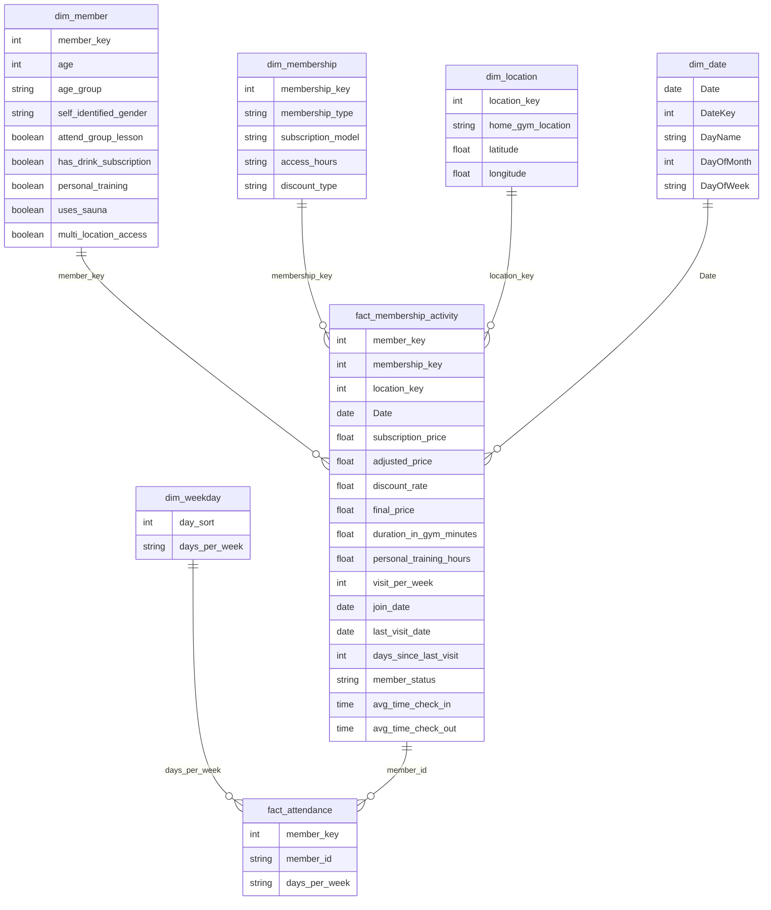

# Fitness Membership Analysis Dashboard

## 📌 Project Overview

The **Fitness Membership Analysis Dashboard** is an end-to-end Power BI analytics project focused on understanding gym member engagement, retention behavior, subscription performance, and operational trends across multiple gym locations.

The dashboard transforms raw membership activity data into actionable business insights through:

* Customer retention analysis
* Churn monitoring
* Revenue performance tracking
* Membership segmentation
* Gym attendance behavior analysis
* Service adoption analysis

---

# 📑 Table of Contents

* [📌 Project Overview](#-project-overview)
* [🎯 Business Objectives](#-business-objectives)
* [🧱 Data Model Architecture](#-data-model-architecture)

  * [📊 Fact Tables](#-fact-tables)
  * [📘 Dimension Tables](#-dimension-tables)
* [📂 Dataset Column Dictionary](#-dataset-column-dictionary)

  * [👤 Member & Demographic Information](#-member--demographic-information)
  * [🏋️ Gym Attendance & Behavior](#️-gym-attendance--behavior)
  * [🧘 Service Usage & Engagement](#-service-usage--engagement)
  * [💳 Membership & Pricing Information](#-membership--pricing-information)
  * [📍 Location Information](#-location-information)
* [📈 Dashboard Pages](#-dashboard-pages)

  * [1️⃣ Executive Overview Dashboard](#1️⃣-executive-overview-dashboard)
  * [2️⃣ Engagement & Retention Dashboard](#2️⃣-engagement--retention-dashboard)
* [🧠 Business Logic & DAX Calculations](#-business-logic--dax-calculations)
* [🎨 Dashboard Design](#-dashboard-design)
* [🛠 Tools & Technologies](#-tools--technologies)
* [📊 Key Insights](#-key-insights)
* [🚀 Future Improvements](#-future-improvements)
* [📂 Repository Structure](#-repository-structure)
* [📷 Dashboard Preview](#-dashboard-preview)
* [⭐ Data Model](#-data-model)
* [👤 Author](#-author)


# 🎯 Business Objectives

This project aims to help gym operators and business stakeholders answer critical business questions:

* Which membership plans retain members the longest?
* Which gym locations perform best in retention and revenue?
* What are the peak attendance days?
* Which services increase member engagement?
* Which members are at risk of churn?
* How do discounts impact revenue performance?

---

# 🧱 Data Model Architecture

The project follows a **Star Schema** design to improve:

* Query performance
* DAX calculation efficiency
* Scalability
* Dashboard maintainability

---

## 📊 Fact Tables

| Table                      | Description                                                                                  |
| -------------------------- | -------------------------------------------------------------------------------------------- |
| `fact_membership_activity` | Core transactional membership activity data including retention, pricing, and visit behavior |
| `fact_attendance`          | Attendance-level analysis for weekly gym visit behavior                                      |

---

## 📘 Dimension Tables

| Table            | Description                                           |
| ---------------- | ----------------------------------------------------- |
| `dim_member`     | Member demographic and service usage profile          |
| `dim_membership` | Membership plan and subscription information          |
| `dim_location`   | Gym branch location data                              |
| `dim_date`       | Calendar/date dimension                               |
| `dim_weekday`    | Weekday sorting dimension used for attendance visuals |

---

# 📂 Dataset Column Dictionary

## 👤 Member & Demographic Information

| Column                   | Description                                                    |
| ------------------------ | -------------------------------------------------------------- |
| `age`                    | Age of the gym member                                          |
| `self_identified_gender` | Self-reported gender identity                                  |
| `multi_location_access`  | Indicates whether the member can access multiple gym locations |

---

## 🏋️ Gym Attendance & Behavior

| Column                    | Description                                          |
| ------------------------- | ---------------------------------------------------- |
| `visit_per_week`          | Number of gym visits per week                        |
| `days_per_week`           | Days of the week the member typically visits the gym |
| `avg_time_check_in`       | Average daily check-in time                          |
| `avg_time_check_out`      | Average daily check-out time                         |
| `duration_in_gym_minutes` | Average duration spent in the gym per visit          |
| `last_visit_date`         | Most recent gym visit date                           |
| `join_date`               | Membership start/join date                           |

---

## 🧘 Service Usage & Engagement

| Column                    | Description                                                  |
| ------------------------- | ------------------------------------------------------------ |
| `attend_group_lesson`     | Indicates participation in group classes                     |
| `personal_training`       | Indicates whether the member uses personal training services |
| `personal_training_hours` | Total personal training hours used                           |
| `uses_sauna`              | Indicates sauna/spa usage                                    |
| `has_drink_subscription`  | Indicates beverage/protein subscription usage                |

---

## 💳 Membership & Pricing Information

| Column               | Description                                                |
| -------------------- | ---------------------------------------------------------- |
| `membership_type`    | Membership tier (Basic, Standard, Premium, Elite)          |
| `subscription_model` | Billing frequency model (Monthly, Quarterly, Annual, etc.) |
| `subscription_price` | Base membership subscription price                         |
| `adjusted_price`     | Price after pricing adjustments                            |
| `discount_type`      | Type of discount applied                                   |
| `discount_rate`      | Discount percentage                                        |
| `final_price`        | Final amount paid after discount                           |
| `access_hours`       | Allowed gym access schedule                                |

---

## 📍 Location Information

| Column              | Description                          |
| ------------------- | ------------------------------------ |
| `home_gym_location` | Primary gym branch location          |
| `latitude`          | Latitude coordinate of gym location  |
| `longitude`         | Longitude coordinate of gym location |

---

# 📈 Dashboard Pages

---

# 1️⃣ Executive Overview Dashboard

## Key KPIs

* Total Members
* Total Revenue
* Total Discount
* Average Subscription Price

## Analytics Included

* Revenue overtime analysis
* Revenue decomposition tree
* Revenue by location
* Revenue by discount type
* Revenue by membership type
* Revenue by age group

---

# 2️⃣ Engagement & Retention Dashboard

## Key KPIs

* Retention Rate
* Average Visits Per Week
* Average Gym Time
* Average Personal Training Hours

## Analytics Included

* Gym Peak Days
* Visit Frequency vs Average Time Spent
* Personal Training Adoption %
* Group Session Adoption %
* Retention by Subscription
* Top 5 Retention by Location
* Member Churn Monitoring Table

---

# 🧠 Business Logic & DAX Calculations

---

## Total Members

```DAX id="mjlwm0"
Total Members = COUNTROWS(fact_membership_activity)
```

---

## Active Members

```DAX id="i0jlwm"
Active Members =
CALCULATE(
    [Total Members],
    fact_membership_activity[days_since_last_visit] <= 30
)
```

---

## At Risk Members

```DAX id="i0jlwm"
At Risk Members =
CALCULATE(
    [Total Members],
    fact_membership_activity[days_since_last_visit] <= 50
)
```

---

## Retention Rate

```DAX id="tjlwm1"
Retention % =
DIVIDE(
    [Active Members] + [At Risk Members],
    [Total Members],
    0
)
```

---

## Member Status

```DAX id="jlwm2"
Member Status =
SWITCH(
    TRUE(),

    fact_membership_activity[days_since_last_visit] <= 30,
        "Active",

    fact_membership_activity[days_since_last_visit] <= 50,
        "At Risk",

    "Churned"
)
```

---

# 🎨 Dashboard Design

## Design Style

* Dark Theme UI
* Neon Purple Accent Palette
* Enterprise-style KPI Cards
* Interactive Analytics Experience

---

## User Experience Features

* Dynamic slicer panel
* Bookmark-driven popup filters
* Interactive cross-filtering
* Responsive dashboard layout
* Drill-down enabled visuals

---

# 🛠 Tools & Technologies

| Technology           | Purpose                                    |
| -------------------- | ------------------------------------------ |
| Power BI             | Data Visualization & Dashboard Development |
| DAX                  | Business Logic & Measures                  |
| Power Query          | Data Cleaning & Transformation             |
| CSV Dataset          | Data Source                                |
| Star Schema Modeling | Data Warehouse Design                      |

---

# 📊 Key Insights

* Premium and Elite memberships generate higher retention rates.
* Weekend gym attendance is significantly higher than weekdays.
* Members using personal training services demonstrate lower churn risk.
* Multi-location access is associated with higher engagement levels.
* Discount campaigns improve acquisition but may reduce average revenue per user.

---

# 🚀 Future Improvements

Potential future enhancements include:

* Predictive churn modeling using Machine Learning
* Real-time gym occupancy monitoring
* Customer lifetime value (CLV) analysis
* AI-powered recommendation system
* Mobile responsive dashboard optimization
* Streamlit deployment for web-based analytics

---

# 📂 Repository Structure

```text id="wjlwm3"
├── dashboard/
│   └── Fitness_Membership_Analysis.pbix
│
├── dataset/
│   └── Fitness_Membership_Analytics_Dataset.csv
│
├── images/
│   ├── OverviewDashboard.png
│   ├── EngagementAndRetention.png
│   └── DataModel.png
│
├── docs/
│
└── README.md
```

---

# 📷 Dashboard Preview

## Executive Overview Dashboard


---

## Engagement & Retention Dashboard


---

## Data Model

## ⭐ Data Model

The project follows a star-schema-style dimensional model optimized for analytical reporting and Power BI visualization.



### Model Design Notes

* The data model follows a star schema architecture for optimized analytical querying.
* Dimension tables store descriptive business attributes.
* Fact tables capture membership activity and gym attendance behavior.
* Helper tables used exclusively for Power BI calculations and slicer logic were intentionally excluded from the ERD for clarity.

---

# 👤 Author

**Đào Minh Thuấn**

* GitHub: [Thuan Dao Git Hub](https://github.com/daominhthuan42)
* LinkedIn: [Thuan Dao Linkedlin](https://www.linkedin.com/in/%C4%91%C3%A0o-minh-thu%E1%BA%A5n-528084286/?skipRedirect=true)
